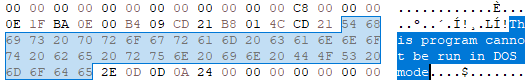
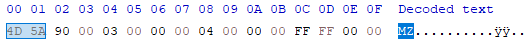
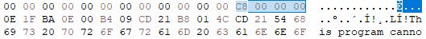
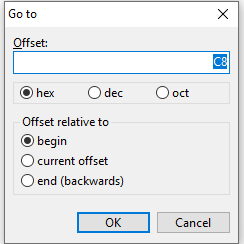
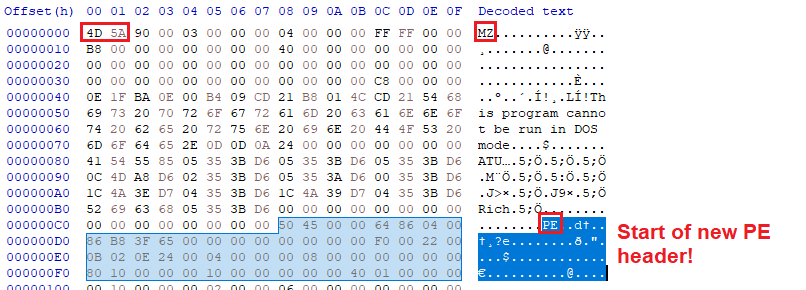

# Dos header

**First of all, what's the DOS header?**

In Portable Executable (PE) files, the DOS header is the very first structure at the beginning of the file. It dates back to the early days of Windows and MS-DOS, and **it remains in modern PE files for backward compatibility.**

If you try to run the executable in a DOS environment, the stub typically displays this famous message:

```
"This program cannot be run in DOS mode."
```


# C representation of the DOS_HEADER
```c
typedef struct _IMAGE_DOS_HEADER {  
    WORD e_magic;    // Magic number (MZ)
    WORD e_cblp;     // Bytes on last page of file
    WORD e_cp;       // Pages in file
    WORD e_crlc;     // Relocations
    WORD e_cparhdr;  // Size of header in paragraphs
    WORD e_minalloc; // Minimum extra paragraphs needed
    WORD e_maxalloc; // Maximum extra paragraphs needed
    WORD e_ss;       // Initial (relative) SS value
    WORD e_sp;       // Initial SP value
    WORD e_csum;     // Checksum
    WORD e_ip;       // Initial IP value
    WORD e_cs;       // Initial (relative) CS value
    WORD e_lfarlc;   // File address of relocation table
    WORD e_ovno;     // Overlay number
    WORD e_res[4];   // Reserved words
    WORD e_oemid;    // OEM identifier (for e_oeminfo)
    WORD e_oeminfo;  // OEM information; e_oemid specific
    WORD e_res2[10]; // Reserved words
    LONG e_lfanew;   // File address of new exe header (important!)
} IMAGE_DOS_HEADER, *PIMAGE_DOS_HEADER;
```
# Key fields in the DOS header

`e_magic`: a 2-byte signature that must equal to `MZ` (`0x5A4D` in hexadecimal). This sequence lets the loader know that the file is a valid DOS executable (and by extension, a valid PE file).


`e_lfanew`: a 4-byte field that contains the offset (relative to the start of `MZ` signature) where the real PE header begins.


Here, we can see that `e_lfanew` corresponds to the byte sequence `C8 00 00 00`.

In HxD, let's go to offset `C8`, relative to the file start (`begin`):




You can see the `PE` signature, highlighted in red!

And here, and after it, the NT Headers start:

**IMAGE_FILE_HEADER**

**IMAGE_OPTIONAL_HEADER**

then Section Headers (.text, .rdata, .data, etc.)
Basically, Windows uses `e_lfanew` to find the **IMAGE_NT_HEADERS** structure.

